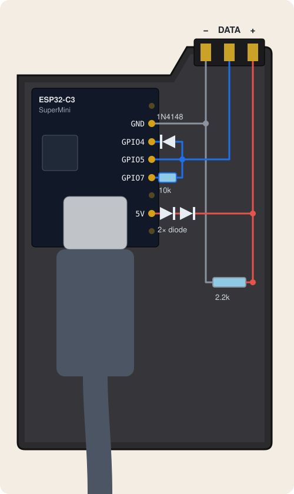
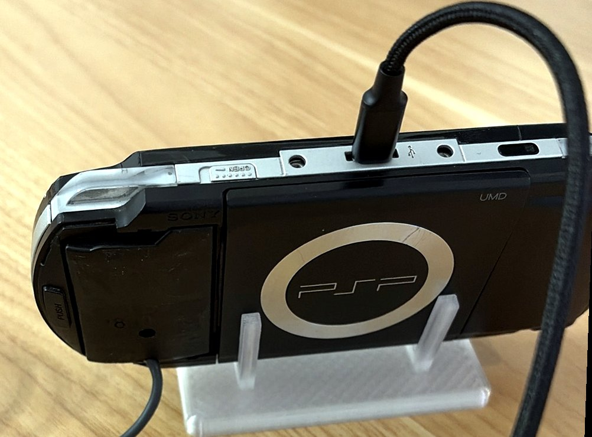

# pspkit-autoboot

Unattended PSP-1000 test bench:

- **One relay switches the PSP and the ESP32** together (e.g. a smart plug).
- **Boots straight into PSPLink** on power-on, no button press.
- **`autoboot.sh` power-cycles back into PSPLink**, e.g. to recover from and debug system freezes.

An ESP32-C3 inside an empty battery shell poses as the battery, "inserts" itself after power-on and passes Syscon's battery authentication with serial `0x00000000` (autoboot). ARK then starts PSPLink instead of the XMB. The PSP itself stays unmodified: no soldering, no opening the case.

<p>
  
  
</p>

> The two diodes that drop 5 V to ≈ 3.7 V on `+` are a hack; a proper 3.7 V regulator would be better. Never put 5 V on `+` directly.

## How to use

**1. ESP32:** flash the sketch.

```
arduino-cli compile --fqbn esp32:esp32:esp32c3:CDCOnBoot=cdc .
arduino-cli upload -p /dev/ttyACM0 --fqbn esp32:esp32:esp32c3:CDCOnBoot=cdc .
```

**2. PSP:** needs ARK with cIPL, nothing is written to NAND. In `PSP/SAVEDATA/ARK_01234/`:

- Back up `VBOOT.PBP` and `SETTINGS.TXT`
- Copy PSPLink's `EBOOT.PBP` as `VBOOT.PBP`, plus its `.prx` files and `psplink.ini`
- In `SETTINGS.TXT`:
  ```
  always, launcher, on
  always, skiplogos, on
  ```

**3. autoboot.sh:** relay via Home Assistant or ESPHome, set in `~/.config/pspkit-autoboot.env`.

```
./autoboot.sh                    # power-cycle, wait for PSPLink
test/cycletest.sh <runs> <dir>   # repeat it
```

Based on [Baryon ESPer](https://github.com/NyxefTheRealOne/Baryon_ESPer) and [BaryonSweeper](https://github.com/khubik2/pysweeper). GPL-3.0.
